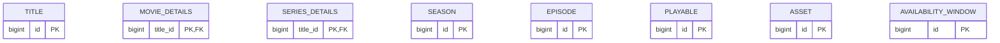

# Catalog data model

Entity-relationship diagram for the catalog. Design decisions are recorded in [docs/adr](adr/).

```mermaid
erDiagram
    %% Relationships: replace each ?? with a cardinality symbol (||, o|, o{, |{)
    %% TITLE ??--?? MOVIE_DETAILS : "has"
    %% TITLE ??--?? SERIES_DETAILS : "has"
    %% SERIES_DETAILS ??--?? SEASON : "has"
    %% SEASON ??--?? EPISODE : "contains"
    %% MOVIE_DETAILS ??--?? PLAYABLE : "is played as"
    %% EPISODE ??--?? PLAYABLE : "is played as"
    %% PLAYABLE ??--?? ASSET : "has"
    %% PLAYABLE ??--?? AVAILABILITY_WINDOW : "is available in"

    TITLE {
        bigint id PK
    }
    MOVIE_DETAILS {
        bigint title_id PK, FK
    }
    SERIES_DETAILS {
        bigint title_id PK, FK
    }
    SEASON {
        bigint id PK
    }
    EPISODE {
        bigint id PK
    }
    PLAYABLE {
        bigint id PK
    }
    ASSET {
        bigint id PK
    }
    AVAILABILITY_WINDOW {
        bigint id PK
    }
```

## Notes

-